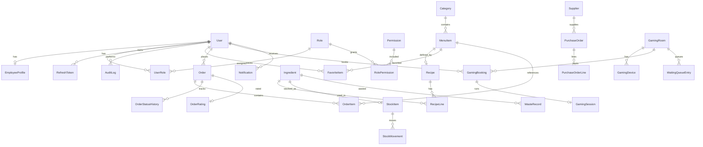

# Database Design & ERD

## Design Principles

- 3NF normalized core; denormalized snapshots where history must not drift (order lines, recipe snapshots)
- UUID primary keys (`uuid(7)`-compatible via Prisma `@default(uuid())`)
- Soft delete via `deletedAt` on master data
- `createdAt` / `updatedAt` everywhere; `createdById` where audit matters
- Explicit enums for state machines
- Composite unique constraints for business keys
- Indexes on FKs, status filters, and search columns

## Domain Groups

### 1. Identity & RBAC

```
User ──┬── UserRole ── Role ── RolePermission ── Permission
       ├── RefreshToken
       ├── EmployeeProfile
       └── AuditLog
```

### 2. Catalog & Recipes

```
Category ── MenuItem ── Recipe ── RecipeLine ── Ingredient
                │
           FavoriteItem
```

### 3. Orders

```
Order ── OrderItem ── (MenuItem snapshot fields)
  │         └── OrderItemRecipeSnapshot
  ├── OrderStatusHistory
  └── OrderRating
```

### 4. Inventory & Procurement

```
Ingredient ── StockItem ── StockMovement
Product (sellable packaged) ── StockItem
Supplier ── PurchaseOrder ── PurchaseOrderLine
WasteRecord
```

### 5. Gaming

```
GamingRoom ── GamingDevice
GamingBooking ── GamingSession
WaitingQueueEntry
```

### 6. Platform

```
Notification
AppSetting
Upload
RewardAccount / RewardTransaction
FreeDrinkBalance / FreeDrinkTransaction
```

## Entity Relationship (Mermaid)



## Core Enums

| Enum | Values |
|------|--------|
| `UserStatus` | ACTIVE, INACTIVE, SUSPENDED |
| `OrderStatus` | PENDING, ACCEPTED, REJECTED, PREPARING, READY, COLLECTED, COMPLETED, CANCELLED, ARCHIVED |
| `OrderType` | IMMEDIATE, SCHEDULED |
| `StockMovementType` | IN, OUT, ADJUSTMENT, WASTE, PURCHASE, RETURN |
| `PurchaseOrderStatus` | DRAFT, SUBMITTED, PARTIAL, RECEIVED, CANCELLED |
| `GamingBookingStatus` | PENDING, CONFIRMED, ACTIVE, COMPLETED, CANCELLED, NO_SHOW |
| `WaitingQueueStatus` | WAITING, NOTIFIED, SEATED, LEFT, CANCELLED |
| `NotificationChannel` | IN_APP, PUSH, EMAIL, SMS |
| `NotificationStatus` | PENDING, SENT, READ, FAILED |
| `UnitOfMeasure` | ML, G, KG, L, PCS, CUP |

## Indexes (critical)

| Table | Index | Why |
|-------|-------|-----|
| `orders` | `(status, createdAt)` | Barista queue |
| `orders` | `(userId, createdAt)` | History |
| `orders` | `(scheduledFor)` | Scheduler |
| `order_items` | `(orderId)` | Join |
| `stock_items` | `(quantity)` partial / alert query | Low stock |
| `stock_movements` | `(ingredientId, createdAt)` | Consumption reports |
| `menu_items` | `(categoryId, isAvailable)` | Browse |
| `menu_items` | GIN/trigram on `name` (future) | Search |
| `gaming_bookings` | `(roomId, startAt, endAt)` | Availability |
| `notifications` | `(userId, isRead, createdAt)` | Inbox |
| `audit_logs` | `(resource, resourceId)` | Lookup |
| `refresh_tokens` | `(tokenHash)` unique | Auth |
| `users` | `(email)` unique | Login |

## Constraints

- `RecipeLine.quantity > 0`
- `OrderItem.quantity > 0`
- `StockItem.quantity >= 0` (enforce in app + check constraint)
- `GamingBooking`: `endAt > startAt`
- Unique: `(roleId, permissionId)`, `(userId, roleId)`, `(userId, menuItemId)` favorites
- One active recipe per menu item (`isActive = true`)

## Soft Delete Policy

Soft delete: User, Category, MenuItem, Ingredient, Supplier, GamingRoom, GamingDevice  
Hard delete / archive: RefreshToken (revoke), Order → ARCHIVED status (retain forever)

## Reporting Strategy

Operational queries against normalized tables.  
Heavy reports: materialized views or nightly aggregates (`report_daily_stats`) — Phase 3.
